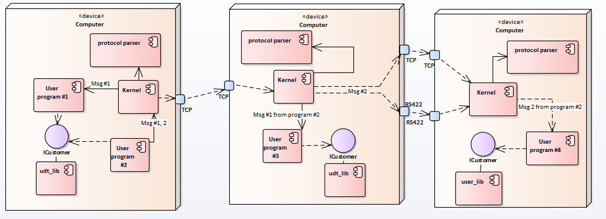

# Annotation
UDT (universal data transmitter) is used to organize communication 
between programs.
It can:
* Quickly transfer data between programs running on the one computer (real speed
  limited only by frequency and regardless of data size);
* Record and display any transmitted message in a web browser;
* Generate a protocol header file;
* Synchronize time (model and real) between programs;
* Simplify the development of a program based on agent-oriented program's 
architecture using a subscriber-publisher pattern;
* Transmit data via RS422(RS232) and Ethernet;
* Provide warm and cold channel redundancy;
* Help to organize warn and cold reservation of programs;
* Quickly integrates with exists programs via RS485(RS422, RS232), UDP, TCP, 
UnixSocket, Fifo(Pipe),QnxMessage sockets;
* By oneself configure without changing the configuration file (just 
start UDT on all computers);
* Transfers data between programs written on different languages;
* Changes endian of the message if need (the programmer doesn't need 
to consider on it);
* Allow to expand of messages using an inherit idiom;
* Provide message's version control;
* Return error codes if message is not delivered to program or 
if it isn't correct.

UDT is running on QNX, Linux and Windows OS.
# Principle of Working
UDT is consist of two components: "Kernel" and "user_lib". The "Kernel" is an
executable file that is realising the logic of working UDT. The "user_lib" is 
an dynamic library that is used for communication a user's program with the
"Kernel". The "Kernel" is based on plugin architecture.  Accordingly the library 
that implements the user's protocol is a plugin for the "Kernel" which is
 realizing the next functions:
* Parse "raw" byte buffer;
* Swap the byte order in the message on the demand of the "Kernel";
* Serialize (Deserialize) the message to (from) json;
The library that implements user's protocol can be generated (see documentation)
 or programmed manually (see examples).
 
 
# [Installation instructions](INSTALL.md)

# [Quick start](QuickStart.md)